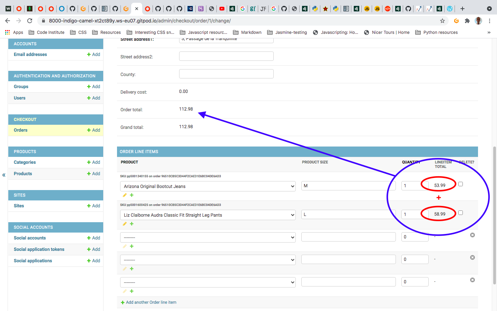
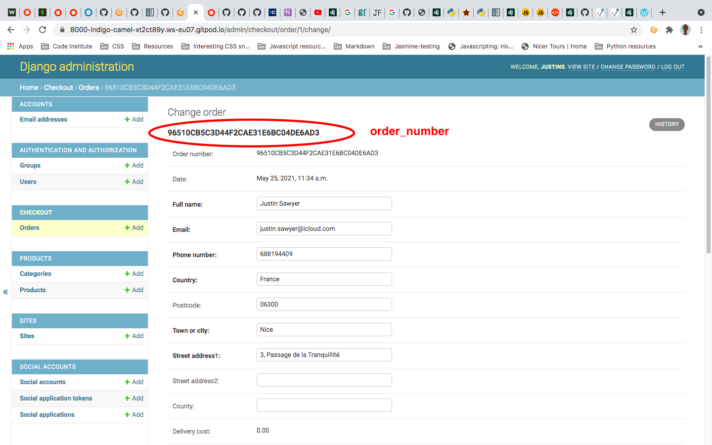
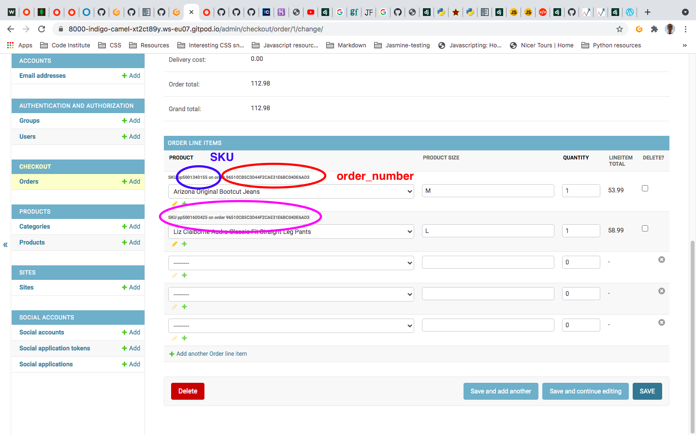

## CHECKOUT
### Models

The checkout functionality needs to be in a dedicated app.

1. Create the app "checkout" using `python3 manage.py startapp checkout` and add it to the list of INSTALLED_APPS in settings.py

#### Creating and Tracking Orders

1. In checkout/models.py, create the Order class and add its fields:

	```
    from django.db import models

    class Order(models.Model):
	    # editable=False for the order_number as this needs to be permanent and unchangeable
        order_number = models.CharField(max_length=32, null=False, editable=False)
        full_name = models.CharField(max_length=50, null=False, blank=False)
        email = models.EmailField(max_length=254, null=False, blank=False)
        phone_number = models.CharField(max_length=20, null=False, blank=False)
        country = models.CharField(max_length=40, null=False, blank=False)
	    # blank=True as this field may not apply to all addresses
        postcode = models.CharField(max_length=20, null=True, blank=True)
        town_or_city = models.CharField(max_length=40, null=False, blank=False)
        street_address1 = models.CharField(max_length=80, null=False, blank=False)
	    # blank=True as this field may not apply to all addresses
        street_address2 = models.CharField(max_length=80, null=True, blank=True)
        county = models.CharField(max_length=80, null=True, blank=True)
	    # auto_now_add=True automatically add "time of order" stamp to the Order for tracking
        date = models.DateTimeField(auto_now_add=True)
	    # The following fields will be calculated using a model method whenever an order is saved
        delivery_cost = models.DecimalField(max_digits=6, decimal_places=2, null=False, default=0)
        order_total = models.DecimalField(max_digits=10, decimal_places=2, null=False, default=0)
  	    grand_total = models.DecimalField(max_digits=10, decimal_places=2, null=False, default=0)
    ```

2. If the Order model is the equivalent of the entire shopping bag, we also then need to track the products that make up the Order. 

	Thus, we need another model deatiling these, that is related to the Order itself. This model will refer to the actual product inside the Shopping Bag - note that the model Order does not refer to these, only to the order_number.

	It is this model that will refer to things like "sizes", "quantity" and everything that can be returned from the Product model.

	Thus, this model will need to refer via a ForeignKey to both the Order class above and the Product class in products/models.py. We also need to import the Product model from products/models.py

	```
    from django.db import models

    # import the Product model
    from products.models import Product

    class Order(models.Model):
	    # the Order model parameters, above

    class OrderLineItem(models.Model):
        # order can access the Order class using the ForeignKey.
        order = models.ForeignKey(Order, null=False, blank=False, on_delete=models.CASCADE, related_name='lineitems')
	    # product can access the Product class (products/models.py/class Product) using the ForeignKey.
        product = models.ForeignKey(Product, null=False, blank=False, on_delete=models.CASCADE)
	    # Since not all products have a size, both null=True and blank=True
        product_size = models.CharField(max_length=2, null=True, blank=True) # XS, S, M, L, XL
        quantity = models.IntegerField(null=False, blank=False, default=0)
	    # lineitem_total is the cost of the item * quantity.
        lineitem_total = models.DecimalField(max_digits=6, decimal_places=2, null=False, blank=False, editable=False)
    ```

	1. The variable order has been given a related_name so that we can call order.lineitems.filter(), order.lineitems.all() without confusing the code (otherwise, to call the object order from the Order model, we would be calling order.order.all() )

	2. ForeignKey has to have the "on_delete=" argument.

	3. lineitem_total will be automatically generated when the Line Item (item in the bag) is saved

#### Model methods
1. Genarating the order_number

	The order_number shall be generated INSIDE the Order model and of course takes self as an argument:

   ```
    import uuid

    from django.db import models
    from products.models import Product

    class Order(models.Model):
	    # the Order model parameters, above

	    def _generate_order_number(self):
		    """
    	    Generate a random, unique order number using uuid
    	    """
		    return uuid.uuid4().hex.upper()

    class OrderLineItem(models.Model):
        # the OrderLineItem model parameters, above
    ```

	1. The function is prepended with an _ to denote this function is private, only available to the Order model.

	2. To generate the order_number itself, we can simply import the [uuid](https://docs.python.org/3/library/uuid.html#module-uuid) python module. UUID means "Universally Unique Identifiers"

	3. If all you want is a unique ID, you should probably call uuid1() or uuid4(). Note that uuid1() may compromise privacy since it creates a UUID containing the computer’s network address. uuid4() creates a random UUID.

2. Override the default save method

	Since the Order is editable, we need to make sure the order_number is amended and saved with each order. In other words, if an Order does not have an order_number attached to it, we need to add one.

	```
    import uuid

    from django.db import models
    from products.models import Product

    class Order(models.Model):
	    # the Order model parameters, above

	    def _generate_order_number(self):
		    # generate order number function
    
        def save(self, *args, **kwargs):
            """
            Override the original save method to set the order number
            if it hasn't been set already.
            """
            if not self.order_number:
                self.order_number = self._generate_order_number()
	        # Override the save if not self.order_number with self._generate_order_number
            super().save(*args, **kwargs)

    class OrderLineItem(models.Model):
        # the OrderLineItem model parameters, above
    ```

	1. [save()](https://rhettinger.wordpress.com/2011/05/26/super-considered-super/) supercedes the default (original) value/behaviour

3. Update total

	Also in the Order model, we need to update total if an Order changes. To do so, we need to use the aggregate function, and thus need to import Sum from django.db.models

	We are also getting the values of the FREE_DELIVERY_THRESHOLD from settings.py, thus we need to import settings from django.conf

	
	```
    import uuid

    from django.db import models
    from django.db.models import Sum
    from django.conf import settings
    from products.models import Product

    class Order(models.Model):
	    # the Order model parameters, above

	    def _generate_order_number(self):
		# generate order number function
    
        
	    def update_total(self):
            """
	        Update grand total each time a line item is added,
        	accounting for delivery costs.
        	"""
            # Note the use of lineitems for this query.
            # Get lineitem total costs and Sum them, then assign to order_total
        	self.order_total = self.lineitems.aggregate(Sum('lineitem_total'))['lineitem_total__sum']
            # set delivery price (10% of oder price) if FREE_DELIVERY_THRESHOLD (set in settings.py) not reached
        	if self.order_total < settings.FREE_DELIVERY_THRESHOLD:
            	self.delivery_cost = self.order_total * settings.STANDARD_DELIVERY_PERCENTAGE / 100
            # Else set delivery cost to zero
        	else:
            	self.delivery_cost = 0
            # calculate total price
    	    self.grand_total = self.order_total + self.delivery_cost
        	self.save()

        def save(self, *args, **kwargs):
        	# Override the original save method to set the order number

    class OrderLineItem(models.Model):
        # the OrderLineItem model parameters, above
    ```

	1. Sum is one of many classes available in the Aggregates function. [See here for more](https://docs.djangoproject.com/en/3.1/topics/db/aggregation/)

	2. See image below for explanation of self.order_total using the Sum functionality:

		

4. Generate the string method for each model

	```
    import uuid

    from django.db import models
    from django.db.models import Sum
    from django.conf import settings
    from products.models import Product

    class Order(models.Model):
	    # the Order model parameters, above

	    def _generate_order_number(self):
		# generate order number function
     
	    def update_total(self):
	        # Update grand total each time a line item is added,
            # accounting for delivery costs.
        	
        def save(self, *args, **kwargs):
        	# Override the original save method to set the order number

        def __str__(self):
            return self.order_number

    class OrderLineItem(models.Model):
        # the OrderLineItem model parameters, above

        def __str__(self):
            return f'SKU {self.product.sku} on order {self.order.order_number}'
    ```

    
    
    
##### Entire code
```
import uuid

from django.db import models
from django.db.models import Sum
from django.conf import settings

from products.models import Product


# Create your models here.
class Order(models.Model):
    order_number = models.CharField(max_length=32, null=False, editable=False)
    full_name = models.CharField(max_length=50, null=False, blank=False)
    email = models.EmailField(max_length=254, null=False, blank=False)
    phone_number = models.CharField(max_length=20, null=False, blank=False)
    country = models.CharField(max_length=40, null=False, blank=False)
    postcode = models.CharField(max_length=20, null=True, blank=True)
    town_or_city = models.CharField(max_length=40, null=False, blank=False)
    street_address1 = models.CharField(max_length=80, null=False, blank=False)
    street_address2 = models.CharField(max_length=80, null=True, blank=True)
    county = models.CharField(max_length=80, null=True, blank=True)
    date = models.DateTimeField(auto_now_add=True)
    delivery_cost = models.DecimalField(max_digits=6, decimal_places=2, null=False, default=0)
    order_total = models.DecimalField(max_digits=10, decimal_places=2, null=False, default=0)
    grand_total = models.DecimalField(max_digits=10, decimal_places=2, null=False, default=0)

    def _generate_order_number(self):
        """
        Generate a random, unique order number using uuid
        """
        return uuid.uuid4().hex.upper()

    def update_total(self):
        """
        Update grand total each time a line item is added,
        accounting for delivery costs.
        """
        self.order_total = self.lineitems.aggregate(Sum('lineitem_total'))['lineitem_total__sum']
        if self.order_total < settings.FREE_DELIVERY_THRESHOLD:
            self.delivery_cost = self.order_total * settings.STANDARD_DELIVERY_PERCENTAGE / 100
        else:
            self.delivery_cost = 0
        self.grand_total = self.order_total + self.delivery_cost
        self.save()

    def save(self, *args, **kwargs):
        """
        Override the original save method to set the order number
        if it hasn't been set already.
        """
        if not self.order_number:
            self.order_number = self._generate_order_number()
        super().save(*args, **kwargs)

    def __str__(self):
        return self.order_number


class OrderLineItem(models.Model):
    order = models.ForeignKey(Order, null=False, blank=False, on_delete=models.CASCADE, related_name='lineitems')
    product = models.ForeignKey(Product, null=False, blank=False, on_delete=models.CASCADE)
    product_size = models.CharField(max_length=2, null=True, blank=True) # XS, S, M, L, XL
    quantity = models.IntegerField(null=False, blank=False, default=0)
    lineitem_total = models.DecimalField(max_digits=6, decimal_places=2, null=False, blank=False, editable=False)

    def save(self, *args, **kwargs):
        """
        Override the original save method to set the lineitem total
        and update the order total.
        """
        self.lineitem_total = self.product.price * self.quantity
        super().save(*args, **kwargs)

    def __str__(self):
        return f'SKU {self.product.sku} on order {self.order.order_number}'
```

##### Entire code
```
import uuid

from django.db import models
from django.db.models import Sum
from django.conf import settings

from products.models import Product


# Create your models here.
class Order(models.Model):
    order_number = models.CharField(max_length=32, null=False, editable=False)
    full_name = models.CharField(max_length=50, null=False, blank=False)
    email = models.EmailField(max_length=254, null=False, blank=False)
    phone_number = models.CharField(max_length=20, null=False, blank=False)
    country = models.CharField(max_length=40, null=False, blank=False)
    postcode = models.CharField(max_length=20, null=True, blank=True)
    town_or_city = models.CharField(max_length=40, null=False, blank=False)
    street_address1 = models.CharField(max_length=80, null=False, blank=False)
    street_address2 = models.CharField(max_length=80, null=True, blank=True)
    county = models.CharField(max_length=80, null=True, blank=True)
    date = models.DateTimeField(auto_now_add=True)
    delivery_cost = models.DecimalField(max_digits=6, decimal_places=2, null=False, default=0)
    order_total = models.DecimalField(max_digits=10, decimal_places=2, null=False, default=0)
    grand_total = models.DecimalField(max_digits=10, decimal_places=2, null=False, default=0)

    def _generate_order_number(self):
        """
        Generate a random, unique order number using uuid
        """
        return uuid.uuid4().hex.upper()

    def update_total(self):
        """
        Update grand total each time a line item is added,
        accounting for delivery costs.
        """
        self.order_total = self.lineitems.aggregate(Sum('lineitem_total'))['lineitem_total__sum']
        if self.order_total < settings.FREE_DELIVERY_THRESHOLD:
            self.delivery_cost = self.order_total * settings.STANDARD_DELIVERY_PERCENTAGE / 100
        else:
            self.delivery_cost = 0
        self.grand_total = self.order_total + self.delivery_cost
        self.save()

    def save(self, *args, **kwargs):
        """
        Override the original save method to set the order number
        if it hasn't been set already.
        """
        if not self.order_number:
            self.order_number = self._generate_order_number()
        super().save(*args, **kwargs)

    def __str__(self):
        return self.order_number


class OrderLineItem(models.Model):
    order = models.ForeignKey(Order, null=False, blank=False, on_delete=models.CASCADE, related_name='lineitems')
    product = models.ForeignKey(Product, null=False, blank=False, on_delete=models.CASCADE)
    product_size = models.CharField(max_length=2, null=True, blank=True) # XS, S, M, L, XL
    quantity = models.IntegerField(null=False, blank=False, default=0)
    lineitem_total = models.DecimalField(max_digits=6, decimal_places=2, null=False, blank=False, editable=False)

    def save(self, *args, **kwargs):
        """
        Override the original save method to set the lineitem total
        and update the order total.
        """
        self.lineitem_total = self.product.price * self.quantity
        super().save(*args, **kwargs)

    def __str__(self):
        return f'SKU {self.product.sku} on order {self.order.order_number}'
```

Note that the above images were taken after Admin, below, was completed.

### Admin

1. In checkout/admin.py I'll first import the Order and OrderLineItem models

	```
	from django.contrib import admin # Installed automatically
	from .models import Order, OrderLineItem
	```

2. Create the OrderAdmin model

	```
    from django.contrib import admin # Installed automatically
	from .models import Order, OrderLineItem

    class OrderAdmin(admin.ModelAdmin):
        # Read Only Fields
        readonly_fields = ('order_number', 'date',
                           'delivery_cost', 'order_total',
                           'grand_total')

        # fields match appearance of the Order model (Django would change order otherwise as some are readonly fields
        fields = ('order_number', 'date', 'full_name',
                  'email', 'phone_number', 'country',
                  'postcode', 'town_or_city', 'street_address1',
                  'street_address2', 'county', 'delivery_cost',
                  'order_total', 'grand_total',)

        # Restrict the columns that show up in the order list to only a few key items
        list_display = ('order_number', 'date', 'full_name',
                        'order_total', 'delivery_cost',
                        'grand_total',)

        # Default ordering of Orders by most recent
        ordering = ('-date',)
    ```

	1. The model inherits from [admin.ModelAdmin](https://docs.djangoproject.com/en/3.1/ref/contrib/admin/#modeladmin-options)

3. Create an [inline admin class](https://docs.djangoproject.com/en/3.1/ref/contrib/admin/#django.contrib.admin.InlineModelAdmin) (inheriting from admin.TabularInline)
	```
    from django.contrib import admin # Installed automatically
	from .models import Order, OrderLineItem

    class OrderLineItemAdminInline(admin.TabularInline):
        # see OrderLineItem above for contents
        model = OrderLineItem
        readonly_fields = ('lineitem_total',)

    class OrderAdmin(admin.ModelAdmin):
        # the OrderAdmin model above
    ```

	1. This inline item is going to allow us to add and edit line items in the admin right from inside the Order model so when we look at an order, we’ll see a list of editable line items on the same page rather than having to go to the order line item interface for each item in the Order.

	2. This is the same as the OrderLineItem model, except that the lineitem_total field is readonly (to not allow editing of prices from the admin side).

4. Add the [inlines](https://docs.djangoproject.com/en/3.1/ref/contrib/admin/#django.contrib.admin.InlineModelAdmin) to the OrderAdmin model

	```
    from django.contrib import admin # Installed automatically
	from .models import Order, OrderLineItem

    class OrderLineItemAdminInline(admin.TabularInline):
        model = OrderLineItem
        readonly_fields = ('lineitem_total',)

    class OrderAdmin(admin.ModelAdmin):
        # Add the inline items we want to be available in the OrderAdmin model
        inlines = (OrderLineItemAdminInline,)
        # the OrderAdmin model above
    ```

4. Register the models

	`admin.site.register(Order, OrderAdmin)`

	Since the `OrderLineItem` model is available from inside the `OrderLineItemAdminInline`, and the `OrderLineItemAdminInline` is available from inside the `OrderAdmin`, neither `OrderLineItem` nor `OrderLineItemAdminInline` need to be registered.

5. Dry run the migrations to be created

	`python3 manage.py makemigrations --dry-run`

6. Make the migrations

	`python3 manage.py makemigrations`

7. Plan the migrate

	`python3 manage.py migrate --plan`

8. Migrate

	`python3 manage.py migrate`

9. git add, commit, push

### Signals

At the moment, we have a shopping bag that works in the front end. However, this shopping bag is not attached to the backend. Therefore, we need a way to attach the item selected by the user to the Order in the database. In other words, there needs to be a way to update the order total, delivery cost, and grand_total for each order as users add line items to it.

The order of operations is:
1. Create the order
2. Iterate through the shopping bag and add line items to it one by one updating the various costs along the way
3. Generate the total

In the Order model above, we already have a method of attaching the total with the update_total() function.

We now need to attach this to the Order itself.

In other words, we need to call the update_total() function each time an item is added to the shopping bag.

To do so, we use an inbuilt feature of Django called [signals](https://docs.djangoproject.com/en/3.1/topics/signals/)

1. At the same level as the checkout/models.py file, create one called signals.py

2. Import the relevant modules:

	`from django.db.models.signals import post_save, post_delete`

	1. Post implies "after", not POST as HTML, thus:
		1. post_save = after save, send the signal
		2. post_delete = after delete, send the signal
	2. The sig,als are sent (and are thus available) to the entire application

3. Since we are sending signals, we also need to receive those signals:

	`from django.dispatch import receiver`

4. Since we'll be listening for signals from the OrderLineItem model we'll also need to import that:

	`from .models import OrderLineItem`

5. We just need 2 functions now, one to update on save, and one to update on delete:

	```
    from django.db.models.signals import post_save, post_delete
    from django.dispatch import receiver

    from .models import OrderLineItem


    @receiver(post_save, sender=OrderLineItem)
    # sender = the imported OrderLineItem model,
    # instance = the actual instance of the OrderLineItem model that sent it,
    # created = a boolean sent by django referring to whether this is a new instance or one being updated, 
	# **kwargs = any keyword arguments
    def update_on_save(sender, instance, created, **kwargs):
        """
        Update order total on lineitem update/create
        """
        instance.order.update_total()


    @receiver(post_delete, sender=OrderLineItem)
    # Note no "created" argument, as for it to be deleted, it would first have had to have been created
    def update_on_save(sender, instance, **kwargs):
        """
        Update order total on lineitem delete
        """
        instance.order.update_total()
    ```

6. Let django know that there's a new signals module with some listeners in it. To do so, override the ready method and import the signals module into checkout.apps.py using
	```
    def ready(self):
        import checkout.signals
    ```

	The apps.py file becomes:

	```
    from django.apps import AppConfig


    class CheckoutConfig(AppConfig):
        default_auto_field = 'django.db.models.BigAutoField'
        name = 'checkout'

        def ready(self):
            import checkout.signals
    ```

### Forms

With all of the above done for the backend, the database, we need now to create the checkout form itself. To do so, we will of course need to write the necessary HTML, see Templates below. But first, the form itself which will be POSTed.

1. Create new forms.py file at the same level as the models.py file
2. Import forms from django
3. Import the Order model, since this form refers to the Order

	```
    from django import forms
	from .models import Order
    ```

4. Create the OrderForm class that inherits from [forms.ModelForm](https://docs.djangoproject.com/en/3.1/topics/forms/modelforms/#django.forms.ModelForm)

	```
    from django import forms
	from .models import Order
    
	class OrderForm(forms.ModelForm):
	```

5. Give the class meta options that tell django which model it'll be associated with and which fields to render.

    ```
    from django import forms
	from .models import Order
    
	class OrderForm(forms.ModelForm):
	    class Meta:
        model = Order
        fields = ('full_name', 'email', 'phone_number',
                  'street_address1', 'street_address2',
                  'town_or_city', 'postcode', 'country',
                  'county',)
    ```

	1. We are only rendering the items that the user (the purchaser) will complete, as the total, delivery costs and grand total will be automatically rendered.

6. In order to customize the form, override the __init__() method

	```
    from django import forms
    from .models import Order


    class OrderForm(forms.ModelForm):
        class Meta:
            # the Meta class, above

        # Call the default init method to set the form up as it would be by default
        def __init__(self, *args, **kwargs):
            """
            Add placeholders and classes, remove auto-generated
            labels and set autofocus on first field
            """
            # Supercede the default __ init__() method using the super() method
            super().__init__(*args, **kwargs)
            # Set the placeholders dictionary (the input attributes) 
            # and assign their values
            placeholders = {
                'full_name': 'Full Name',
                'email': 'Email Address',
                'phone_number': 'Phone Number',
                'country': 'Country',
                'postcode': 'Postal Code',
                'town_or_city': 'Town or City',
                'street_address1': 'Street Address 1',
                'street_address2': 'Street Address 2',
                'county': 'County',
            }

            # Set the autofocus attribute on the full name field to True 
            # so the cursor will start in the full name field when the user loads the page
            self.fields['full_name'].widget.attrs['autofocus'] = True
            # Iterate terate through the forms fields
            for field in self.fields:
                # if required field
                if self.fields[field].required:
                    # set placeholder to its field and add *
                    placeholder = f'{placeholders[field]} *'
                # if not required field
                else:
                    # set placeholder to its field
                    placeholder = placeholders[field]
                # Set all the placeholder attributes to their values in the dictionary above
                self.fields[field].widget.attrs['placeholder'] = placeholder
                # Add CSS class (to be added later)
                self.fields[field].widget.attrs['class'] = 'stripe-style-input'
                # Remove default labels as placeholders are set via the above code
                self.fields[field].label = False
    ```

7. git add, commit, push

### The Checkout view

1. Create the views.py file at the same level as forms.py
2. Import what is necessary
3. Create the checkout view

    ```
    from django.shortcuts import render, redirect, reverse
    from django.contrib import messages

    from .forms import OrderForm

    # Create your views here.
    def checkout(request):
        # Get the bag from the session or set to empty dictionary if it does not exist
        bag = request.session.get('bag', {})
        # If empty bag
        if not bag:
            # Send Error message and redirect to products
            messages.error(request, "There's nothing in your bag yet")
            return redirect(reverse('products'))

        # Create instance of the OrderForm
        order_form = OrderForm()
        # Create the template and its context (the order form to be rendered)
        template = 'checkout/checkout.html'
        context = {
            'order_form': order_form,
        }

        return render(request, template, context)
    ```
	
### Add the url

1. Create the urls.py file at the same level
2. We can copy its contents from the home urls.py file
3. Change the path in the urlsettings

	`path('', views.checkout, name='checkout'),`

4. Include the checkout urls in the projectlevel urls.py file

	`path('checkout/', include('checkout.urls')),`

## The template

1 Create templates folder at same level as views.py
2. Create checkout folder
3. Create html file `checkout.html`

4. Write the HTML. We can base this on the bag.html file, and alter as necessary. 
	
	The starting point for the template:

	```
    
    

    
        <link rel="stylesheet" href="">
    

    
        <div class="container header-container">
            <div class="row">
                <div class="col">
                
                </div>
            </div>
        </div>
    

    
        <div class="overlay"></div>
        <div class="container">
            <div class="row">
                <div class="col">
                    <hr>
                    <h2 class="logo-font mb-4">Shopping Bag</h2>
                    <hr>
                </div>
            </div>

            <div class="row">
                <div class="col col-lg-6">  
                    <p class="text-muted">Please fill out the form below to complete your order</p> 
                </div>
            </div>
        </div>
    
    ```

5. Note the `` template. Later, we will be stying this page. Tp do so, we will use its own CSS file, which we will create:

	1. At the same level as views.py, create static folder
	2. Inside static folder, create checkout folder
	3. Inside checkout folder, create css folder
	4. Inside css folder, create checkout.css file

6. Automatically format the forms

	Since we are using Bootstrap, we can automatically style the forms using a utility called [django-cripsy-forms](https://django-crispy-forms.readthedocs.io/en/latest/index.html#).

	1. Install using the CLI
	
		`pip3 install django-crispy-forms`

	2. Add crispy-forms to INSTALLED_APPS in settings.py

	3. Also in settings.py, (just above TEMPLATES = [])tell crispy-forms which template pack to use

		`CRISPY_TEMPLATE_PACK = 'bootstrap4'`

	4. It is possible to load crispy-forms just as we do for static files ( but a more efficient way is to add a `builtins` list as a template option in the TEMPLATES = [] list of settings.py. Doing so means access to all crispy_form elements that are needed across all the templates.


        ```
		TEMPLATES = [
            {
                # BACKEND
                # DIRS
                # APP_DIRS
                'OPTIONS': {
                    # context_processors
                    'builtins': [
                        'crispy_forms.templatetags.crispy_forms_tags',
                        'crispy_forms.templatetags.crispy_forms_field',
                    ]
            }
        ]
        ```

		1. [crispy_forms.templatetags.crispy_forms_tags](https://django-crispy-forms.readthedocs.io/en/latest/api_templatetags.html?highlight=crispy_forms.templatetags.crispy_forms_tags#module-templatetags.crispy_forms_tags)
		2. [crispy_forms.templatetags.crispy_forms_field](https://django-crispy-forms.readthedocs.io/en/latest/api_templatetags.html?highlight=crispy_forms.templatetags.crispy_forms_field#templatetags.crispy_forms_field.crispy_field)
		3. All the templatetags available are [listed here](https://django-crispy-forms.readthedocs.io/en/latest/api_templatetags.html).

7. Freeze!

	`pip3 freeze > requirements.txt`

8. Render the form in the checkout template.

	It's probably easiest to include the HTML here, and read through the comments:


```


<!-- necessary for looping through bag_items, below -->



    <link rel="stylesheet" href="">



    <div class="container header-container">
        <div class="row">
            <div class="col">
                
            </div>
        </div>
    </div>



    <div class="overlay"></div>
    <div class="container">
        <div class="row">
            <div class="col">
                <hr>
                <h2 class="logo-font mb-4">Checkout</h2>
                <hr>
            </div>
        </div>

        <div class="row">
            <div class="col-12 col-lg-6 order-lg-last mb-5">
                <p class="text-muted">Order Summary ({{ product_count }})</p>
                <div class="row">
                    <div class="col-7 offset-2">
                        <p class="mb-1 mt-0 small text-muted">Item</p>
                    </div>
                    <div class="col-3 text-right">
                        <p class="mb-1 mt-0 small text-muted">Subtotal</p>
                    </div>
                </div>
                <!-- Loop through bag_items -->
                
                    <div class="row">
                        <div class="col-2 mb-1">
                            <a href="">
                                
                                    
                                
                                    <!-- See below code for this -->
                                    
                                
                            </a>
                        </div>
                        <div class="col-7">
                            <p class="my-0"><strong>{{ item.product.name }}</strong></p>
                            <p class="my-0 small">Size: {{ item.size|upper }}N/A</p>
                            <p class="my-0 small text-muted">Qty: {{ item.quantity }}</p>
                        </div>
                        <div class="col-3 text-right">
                            <p class="my-0 small text-muted">${{ item.product.price | calc_subtotal:item.quantity }}</p>
                        </div>
                    </div>
                
                <hr class="my-0">
                <div class="row text-black text-right">
                    <div class="col-7 offset-2">
                        <p class="my-0">Order Total:</p>
                        <p class="my-0">Delivery:</p>
                        <p class="my-0">Grand Total:</p>
                    </div>
                    <div class="col-3">
                        <p class="my-0">${{ total | floatformat:2 }}</p>
                        <p class="my-0">${{ delivery | floatformat:2 }}</p>
                        <p class="my-0"><strong>${{ grand_total | floatformat:2 }}</strong></p>
                    </div>
                </div>
            </div>
            <div class="col col-lg-6">  
                <p class="text-muted">Please fill out the form below to complete your order</p>
                <!-- The Order Form form. Action url of checkout, method of post, id of payment-form -->
                <form action="" method="POST" id="payment-form">
                    <!-- csrf_token -->
                    
                    <fieldset class="rounded px-3 mb-5">
                        <legend class="fieldset-label small text-black px-2 w-auto">Details</legend>
                        <!-- Access the Order Form and render as crispy field -->
                        {{ order_form.full_name | as_crispy_field }}
                        {{ order_form.email | as_crispy_field }}
                    </fieldset>
                    <fieldset class="rounded px-3 mb-5">
                        <legend class="fieldset-label small text-black px-2 w-auto">Delivery</legend>
                        {{ order_form.phone_number | as_crispy_field }}
                        {{ order_form.country | as_crispy_field }}
                        {{ order_form.postcode | as_crispy_field }}
                        {{ order_form.town_or_city | as_crispy_field }}
                        {{ order_form.street_address1 | as_crispy_field }}
                        {{ order_form.street_address2 | as_crispy_field }}
                        {{ order_form.county | as_crispy_field }}
                        <div class="form-check form-check-inline float-right mr-0">
                            
                                <label class="form-check-label" for="id-save-info">Save this delivery information to my profile</label>
                                <input class="form-check-input ml-2 mr-0" type="checkbox" id="id-save-info" name="save-info" checked>
                            
                                <label class="form-check-label" for="id-save-info">
                                    <a class="text-info" href="">Create an account</a> or 
                                    <a class="text-info" href="">login</a> to save this information
                                </label>
                            
                        </div>
                    </fieldset>
                    <fieldset class="px-3">
                        <legend class="fieldset-label small text-black px-2 w-auto">Payment</legend>
                        <!-- A Stripe card element will go here -->
                        <div class="mb-3" id="card-element"></div>

                        <!-- Used to display form errors -->
                        <div class="mb-3 text-danger" id="card-errors" role="alert"></div>
                    </fieldset>
                    <div class="submit-button text-right mt-5 mb-2">                    
                        <a href="" class="btn btn-outline-black rounded-0">
                            <span class="icon">
                                <i class="fas fa-chevron-left"></i>
                            </span>
                            <span class="font-weight-bold">Adjust Bag</span>
                        </a>
                        <button id="submit-button" class="btn btn-black rounded-0">
                            <span class="font-weight-bold">Complete Order</span>
                            <span class="icon">
                                <i class="fas fa-lock"></i>
                            </span>
                        </button>
                        <p class="small text-danger my-0">
                            <span class="icon">
                                <i class="fas fa-exclamation-circle"></i>
                            </span>
                            <span>Your card will be charged <strong>${{ grand_total|floatformat:2 }}</strong></span>
                        </p>
                    </div>
                </form>
            </div>
        </div>
    </div>

```

9. Products without images

	In the project, currently there are no items without images. However, this might not always be the case. 

	Above, we have added this template `` which refers to the noimage.png file in the media folder. 

	However, so far we have no way to render this image file. To do so, we need to add the media context processor to the settings.py file.

	In the OPTIONS dictioionary of the TEMPLATES list, we add:

	`'django.template.context_processors.media’,`

10. Add the link for checkout to the shopping bag

	`<a href="" class="btn btn-black rounded-0 btn-lg">`


11. git add, commit, push


