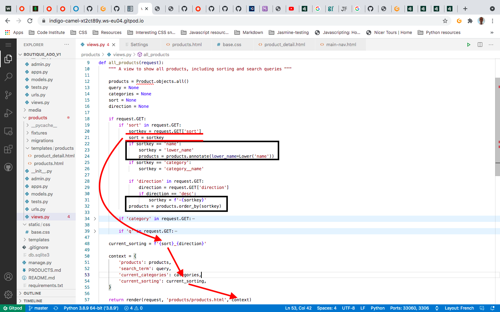

# SORTING
## Sorting by Price, Rating from the Menu

1. Add links with parameters. (These parameters come from their respective Models, thus “price” is a key in the Products model): 

	`?sort=price&direction=asc"`

2. Set original values of these parameters to ‘None’ in relevant view:

	```
	sort = None
	direction = None
	```

3. Check if parameters are in request.GET:

	```
	if request.GET:
    	if 'sort' in request.GET:
	```

4. Set the variable: 

	`sortkey = request.GET[‘sort’]`

5. Reassign sortkey as sort: 

	`sort = sortkey`

	Notes:
    
	1. The reason for copying the sort parameter into a new variable called sortkey is because now we've preserved the original field we want it to sort on - name - but we have the actual field we're going to sort on, lower_name in the sortkey variable. If we had just renamed sort itself to lower_name we would have lost the original field name.

	2. The sortkey we get from the request.get, eventually we'll need to pass into the template as current_sorting.

		However, we need to use the same information to annotate our products to filter them, and to do that we need to manipulate that string.

		Now, with the current code, if we manipulated the original sortkey string, we would end up inserting that manipulated string into the context, and we don't want that. We want to preserve the original so we can pass it into the template.

		By saying sort=sortkey at the top, we create a "preserved" duplicate of the sortkey, that will be passed into the template untouched.

		And we then use the "original" sortkey to manipulate it to annotate our products.

		

6. Set an if statement, if needed, to search by Lower, so that if users type alabama instead of Alabama, the result will be returned:

	```
	if sortkey == 'name':
    	sortkey = 'lower_name'
    	products = products.annotate(lower_name=Lower('name'))
	```

7. Import Lower from django.db.models.functions: 

	`from django.db.models.functions import Lower`

8. For the direction of the sort, we can just reassign sortkey as -sortkey using an f-string:

	```
	if 'direction' in request.GET:
    	direction = request.GET['direction']
    	if direction == 'desc':
    		sortkey = f'-{sortkey}'
	```

9. Using the order_by model method, set the products by their sort criterium: 

	products = products.order_by(sortkey)

10. Return the current sorting methodology to the template using string formatting: 

	`current_sorting = f'{sort}_{direction}'`

11. Add the current_sorting to the context: 

	`'current_sorting': current_sorting,`

## Sorting from the page (not the menu)
1. Add category link to the product card: 
    1. Assuming the product has a category, we use template logic: 
	
		``

    2. Link to category programmatic name: 

		`href="?category={{ product.category.name }}"`

    3. Render friendly name: 

		`{{ product.category.friendly_name }}`

2. Add category linkS to main page:

    1. Loop through categories using template logic: 

		``

    2. Link to the category’s programmatic name: 

		`href="?category={{ c.name }}"`

    3. Render friendly name: 

		`{{ c.friendly_name }}`

## Sorting via dropdown menu and by Category
1. Add the HTML to render the drop down: 

	```
	<div class="col-12 col-md-6 my-auto order-md-last d-flex justify-content-center justify-content-md-end">
    	<div class="sort-select-wrapper w-50">
    	    <select id="sort-selector" class="custom-select custom-select-sm rounded-0 border border-infoblack">
            	<option value="reset" selected>Sort by...</option>
            	<option value="price_asc" selected>Price (low to high)</option>
            	<option value="price_desc" selected>Price (high to low)</option>
            	<option value="rating_asc" selected>Rating (low to high)</option>
            	<option value="rating_desc" selected>Rating (high to low)</option>
            	<option value="name_asc" selected>Name (A-Z)</option>
            	<option value="name_desc" selected>Name (Z-A)</option>
            	<option value="category_asc" selected>Category (A-Z)</option>
            	<option value="category_desc" selected>Category (Z-A)</option>
        	</select>
    	</div>
	</div>
	```

    1. Note that we can use template logic in rendering the CSS in the selector
    2. The values are what is being taken from the view for “current_sorting”
    3. None_None is when no sorting is applied, as we set sort and direction to None in the view
	4. These selected values are coming FROM the view sorting parameters

2. Currently, sorting by category is set as the category’s id. Change this to the category’s name and add to the view:

	```
	if sortkey == 'category':
		sortkey = 'category__name'
	```

3. Add JavaScript to give the dropdown functionality:
    1. The JS needs to go inside the postjsload block: 

		``

    2. Add also a block.super block. This block ensure that the JS is APPENDED TO the url rather than replacing it: 
	
		`{{ block.super }}`

    3. The JS: 
		```
		<script type="text/javascript">
    		$('#sort-selector').change(function() {
        		var selector = $(this);
        		var currentUrl = new URL(window.location);

        		var selectedVal = selector.val();
        
				if(selectedVal != 'reset'){
            			var sort = selectedVal.split('_')[0];
            			var direction = selectedVal.split('_')[1];

            			currentUrl.searchParams.set('sort', sort);
            			currentUrl.searchParams.set('direction', direction);
		
            			window.location.replace(currentUrl);
        		} else {
            			currentUrl.searchParams.delete('sort');
            			currentUrl.searchParams.delete('direction');

            			window.location.replace(currentUrl);
        		}
    		})
		</script>
		```

        4. `{{ block.super }}` does not need an end block

- ### [README](https://github.com/Justin-Sawyer/boutique_ado_v1/blob/master/README.md)
- ### [PRODUCTS app](https://github.com/Justin-Sawyer/boutique_ado_v1/blob/master/PRODUCTS.md)
- ### [SEARCH](https://github.com/Justin-Sawyer/boutique_ado_v1/blob/master/SEARCH.md)
- ### [THE SHOPPING BAG](https://github.com/Justin-Sawyer/boutique_ado_v1/blob/master/THE-SHOPPING-BAG.md)