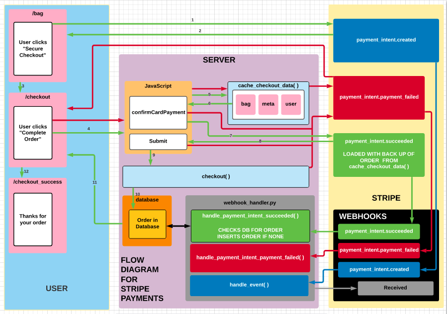

## STRIPE WEBHOOKS

#### Flow diagram for how webhooks will work


Payment works, and we have stopped double pressing of the payment button, and put in place a spinner to tell the cutomer that the payment is going through and the order is being made.

But, we do not have a failsafe in place for if a customer closes the window before the order is submitted but after the payment is made.

For this, we need webhooks.

Each time an event occurs on stripe such as a payment intent being created, a payment being completed and so on stripe sends out what's called a webhook we can listen for.
Webhooks are like the signals django sends each time a model is saved or deleted except that they're sent securely from stripe to a URL we specify.

However, since Stripe has over 100 webhooks, to cover all of them, we could do so with an "if" statement. This would soon get unruly, so instead, we will set up a custom class to which we can pass the event along to our webhook handler and then have a nice convenient method written up for each type of webhook we need.

### Create a Custom Class

1. Create new file in checkout app

	`webhook_handler.py`

2. Import HttpResponse from django.http

	`from django.http import HttpResponse`

3. Create a class called StripeWH_handler and give it an init method
	```
	class StripeWH_Handler:
    	""" Handle Stripe webhooks """

    	def __init__(self, request):
			self.request = request
	```

	1. The init method of the class is a setup method that's called every time an instance of the class is created.
	2. Use the init method to assign the request as an attribute of the class just in case we need to access any attributes of the request coming from stripe.

4. Create a class method that takes the event stripe is sending and returns an HTTP response indicating it was received.
	```
	class StripeWH_Handler:
    	""" Handle Stripe webhooks """

    	def __init__(self, request):
        	self.request = request
    
		# The class method
    	def handle_event(self, event):
        	"""
        	Handle a generic/unknown/unexpected webhook event
        	"""
        	return HttpResponse(
            	content=f'Webhook received: {event["type"]}',
            	status=200
        	)
	```

5. git add, commit, push

6. Create more class method for webhooks and use the above one as a generic method. We need ones for when a payment goes through and when a payment fails, above all.

	```
	from django.http import HttpResponse


	class StripeWH_Handler:
   	 """ Handle Stripe webhooks """

    	def __init__(self, request):
        	self.request = request

		# The generic webhook, note the error message has been changed
    	def handle_event(self, event):
        	"""
        	Handle a generic/unknown/unexpected webhook event
        	"""
        	return HttpResponse(
            	content=f'Unhandled webhook received: {event["type"]}',
            	status=200
        	)

		# Payment Intent Succeeded method
    	def handle_payment_intent_succeeded(self, event):
        	"""
        	Handle the payment_intent.succeeded webhook event
        	"""
        	return HttpResponse(
            	content=f'Webhook received: {event["type"]}',
            	status=200
        	)

		# Payment Intent Payment Failed method
    	def handle_payment_intent_payment_failed(self, event):
        	"""
        	Handle the payment_intent.payment_failed webhook event
        	"""
        	return HttpResponse(
            	content=f'Webhook received: {event["type"]}',
            	status=200
        	)
	```

	When testing these webhooks (see below), change the content of the f strings for clarity

### Set up listening for webhooks
#### The address path

1. Stripe sends webhooks to url addresses, so a url needs to be created. In checkout/urls.py add the path

	`path('wh/', webhook, name='webhook'),`

	1. The address 
	2. Instead of setting a view, set a function name (webhook)
	2. The name

2. Import the (yet to be created) function into urls.py

	`from .webhooks import webhook`

#### The webhook function

1. Create webhooks.py file in checkout app (which is what will be imported above), at the same level as the webhook handler file

2. Create the webhook function that takes a request. (The function below has been coped from Stripe's docs)

	```
	def webhook(request):
    	# Listen for webhooks from Stripe
    	payload = request.body
    	sig_header = request.META['HTTP_STRIPE_SIGNATURE']
    	event = None

    	try:
        		event = stripe.Webhook.construct_event(
            		payload, sig_header, endpoint_secret
        		)
    	except ValueError as e:
        		# Invalid payload
        		return HttpResponse(status=400)
    	except stripe.error.SignatureVerificationError as e:
        		# Invalid signature
        		return HttpResponse(status=400)
    
    	# Handle the event
    	if event.type == 'payment_intent.succeeded':
        		payment_intent = event.data.object # contains a stripe.PaymentIntent
        		print('PaymentIntent was successful')
    	elif event.type == 'payment_method.attached':
        		payment_method = event.data.object # contains a stripe.PaymentMethod
        		print('PaymentMethod was attached to a Customer!')
    	# ... handle other event.types
    	else:
        		# Unexpected event.type
        		return HttpResponse(status=400)

    	return HttpResponse(status=200)
	```

3. We are looking for webhooks, so change "endpoint_secret" to "wh_secret"

4. Add generic except block

	```
	def webhook(request):
    	# Listen for webhooks from Stripe
    	payload = request.body
    	sig_header = request.META['HTTP_STRIPE_SIGNATURE']
    	event = None

    	try:
        		event = stripe.Webhook.construct_event(
            		payload, sig_header, wh_secret   # Note change
        		)
    	except ValueError as e:
        		# Invalid payload
        		return HttpResponse(status=400)
    	except stripe.error.SignatureVerificationError as e:
        		# Invalid signature
        		return HttpResponse(status=400)
    	except Exception as e:
        		# generic exception
        		return HttpResponse(content=e, status=400)
	```

5. Remove entire # Handle the event block and return statement. This will be replaced with custom code.

6. Set up Stripe api key and get wh_secret from settings

	```
	def webhook(request):
    	""" Listen for webhooks from Stripe """
    	# Set up
    	wh_secret = settings.STRIPE_WH_SECRET
    	stripe.api_key = settings.STRIPE_SECRET_KEY

    	# Get the webhook data and verify its signature
    	payload = request.body
    	sig_header = request.META['HTTP_STRIPE_SIGNATURE']
    	event = None

    	try:
        		event = stripe.Webhook.construct_event(
            	payload, sig_header, wh_secret
        		)
    	except ValueError as e:
        		# Invalid payload
        		return HttpResponse(status=400)
    	except stripe.error.SignatureVerificationError as e:
        		# Invalid signature
        		return HttpResponse(status=400)
    	except Exception as e:
        		# generic exception
        		return HttpResponse(content=e, status=400)
	```

7. Import settings for accessing Stripe's api_key and wh_secret

	`from django.conf import settings`

8. Import HttpResponse from django.http 

	`from django.http import HttpResponse`

9. Import the webhook handler class from checkout/webhook_handler.py

	`from checkout.webhook_handler import StripeWH_Handler`

10. Import stripe

	`import stripe`

11. Since Stripe does not send CSRF tokens, csrf_exempt will be needed to be imported from django.views.decorators.csrf 

	`from django.views.decorators.csrf import csrf_exempt`

12. Import require_POST from django.views.decorators.http to ensure that the function ONLY posts requests

	`from django.views.decorators.http import require_POST`

13. Add csrf_exempt and require_POST decorators to the function

	```
	@require_POST
	@csrf_exempt
	```

The code so far:

```
from django.conf import settings
from django.http import HttpResponse
from django.views.decorators.http import require_POST 
from django.views.decorators.csrf import csrf_exempt

from checkout.webhook_handler import StripeWH_Handler

import stripe


@require_POST
@csrf_exempt
def webhook(request):
    """ Listen for webhooks from Stripe """
    # Set up
    wh_secret = settings.STRIPE_WH_SECRET
    stripe.api_key = settings.STRIPE_SECRET_KEY

    # Get the webhook data and verify its signature
    payload = request.body
    sig_header = request.META['HTTP_STRIPE_SIGNATURE']
    event = None

    try:
        event = stripe.Webhook.construct_event(
            payload, sig_header, wh_secret
        )
    except ValueError as e:
        # Invalid payload
        return HttpResponse(status=400)
    except stripe.error.SignatureVerificationError as e:
        # Invalid signature
        return HttpResponse(status=400)
    except Exception as e:
        # generic exception
        return HttpResponse(content=e, status=400)
```

#### Settings

1. Add the Stripe wh_secret variable to settings.py

	```
	# Stripe
	FREE_DELIVERY_THRESHOLD = 50
	STANDARD_DELIVERY_PERCENTAGE = 10
	STRIPE_CURRENCY = 'usd'
	STRIPE_PUBLIC_KEY = os.getenv('STRIPE_PUBLIC_KEY', '')
	STRIPE_SECRET_KEY = os.getenv('STRIPE_SECRET_KEY', '')
	STRIPE_WH_SECRET = os.getenv('STRIPE_WH_SECRET', '')
	```

#### Confirm the code works

1. Add a print statement and return the HttpResponse to the webhook function in webhooks.py

	```
	print('Success!')
	return HttpResponse(status=200)
	```

2. Run the server and get the site's http address. Copy this and add to [endpoints](https://dashboard.stripe.com/test/webhooks) on the Stripe dashboard. 

3. Add the app name and urlpattern (and trailing slash) to the copied address

	`http://address/checkout/wh/`

4. Click "receive all events" and then click "Add endpoint"

5. Copy the Signing Secret

6. Export the Signing Secret as STRIPE_WH_SECRET in the CLI

	`export STRIPE_WH_SECRET=the copied signing secret`

7. Run server once again

8. Click "Send test webhook" on the Strip dashboard

9. Success! should now be printed in the terminal

#### Modify the view to use the webhook handler (StripeWH_Handler)

1. In webhooks.py delete the print statement and return statement from the function.

2. In their place, create an instance of of the StripeWH_Handler and pass in the request

	```
	# Set up a webhook handler
	handler = StripeWH_Handler(request)
	```

3. Create a dictionary called event_map. The dictionary’s keys will be the names of the webhooks coming from stripe, while its values will be the actual methods inside the handler

	```
	# Map webhook events to relevant handler functions
	event_map = {
    	'payment_intent.suceeded': handler.handle_payment_intent_succeeded,
    	'payment_intent.payment_failed': handler.handle_payment_intent_payment_failed,
	}
	```

4. Get the type of the event from stripe. This will be stored in a key called type and will return something like "payment intent.succeeded" or "payment intent.payment failed"

	```
	# Get the webhook type from Stripe
	event_type = event['type']
	```

5. Look up the key in the dictionary and assign its value to a variable called event_handler

	```
	# If there's an handler for it, get it from the event map
	# Use the generic handler by default
	event_handler = event_map.get(event_type, handler.handle_event)
	```

6. Get the response from the webhook handler, we can just call event_handler, and pass it the event

	```
	# Call the event handler with the event
	response = event_handler(event)
	```

7. Return the response to stripe
	`return response`

8. Go to stripe's dashboard and send test webhooks concerned

9. git add, commit, push

## Ensuring the order reaches the Database: a backup

We have catered for double clicking the payment button and preventing double entries. 

But so far, we have no way to ensure an order reaches the database if the user closes the browser window too early. Thus, a payment might be sent, but we might not get the order. 

We can ensure we *never* miss the order creation by actually attaching the order to the call we make to Stripe. It is thus attached to the json of the payment_intent object (`payment_intent.succeeded`) and thus to the webhook that Stripe creates. 

We then retrieve the back up of the order from the webhook code and add the concerned details to the database, if the order has not been created already.

### Add the shipping and billing details to stripe.confirmCardPayment()

1. Add the order form's billing_details (and shipping details) to the JavaScript Handle Form Submit code

    ```
    // Handle form submit
    var form = document.getElementById('payment-form');

    form.addEventListener('submit', function(ev) {
        ev.preventDefault();
        card.update({ 'disabled': true});
        $('#submit-button').attr('disabled', true);
        $('#payment-form').fadeToggle(100);
        $('#loading-overlay').fadeToggle(100);	
        stripe.confirmCardPayment(clientSecret, {
            payment_method: {
                card: card,
                // Add billing_details object
                // webhook handler key: (trim whitespace from) our form value
                billing_details: {
                    name: $.trim(form.full_name.value),
                    phone: $.trim(form.phone_number.value),
                    email: $.trim(form.email.value),
                    address: {
                        line1: $.trim(form.street_address1.value),
                        line2: $.trim(form.street_address2.value),
                        city: $.trim(form.town_or_city.value),
                        country: $.trim(form.country.value),
                        state: $.trim(form.county.value),
                    }
                }
            },
            shipping: {
                name: $.trim(form.full_name.value),
                phone: $.trim(form.phone_number.value),
                address: {
                    line1: $.trim(form.street_address1.value),
                    line2: $.trim(form.street_address2.value),
                    city: $.trim(form.town_or_city.value),
                    country: $.trim(form.country.value),
                    postal_code: $.trim(form.postcode.value),
                    state: $.trim(form.county.value),
                }
            }           
        }).then(function(result) {
            if (result.error) {
                var errorDiv = document.getElementById('card-errors');
                var html = `
                    <span class="icon" role="alert">
                    <i class="fas fa-times"></i>
                    </span>
                    <span>${result.error.message}</span>`;
                $(errorDiv).html(html);
                $('#payment-form').fadeToggle(100);
                $('#loading-overlay').fadeToggle(100);
                card.update({ 'disabled': false});
                $('#submit-button').attr('disabled', false);
            } else {
                if (result.paymentIntent.status === 'succeeded') {
                    form.submit();
                }
            }
        });
    });
    ```

### save_info, bag and user

The webhook has no way to handle the save_info details, since the confirmCardPayment method does not support it. We can however add it to a key of the `payment_intent` object called "metadata". This however has to be done from the server-side.

Since we are doing this, we can also attach the bag contents and the user details to the metadata, effectively creating 
	1. a back up of the order
	2. a way to save the user's "remember me" preference
	3. a back up of the user's details

In other words, what is going to happen is that as the JavaScript is running, before it calls the confirmCardPayment method, it will request to post the save_details to a view.

From this view, the `stripe.PaymentIntent` method will be modified.

And from here, when we receive the webhook, we will have a full back up of the above, if needed.

Write a new function view to handle this in views.py

1. Import HttpResponse from django.shortcuts
2. Import require_POST from django.views.decorators.http
3. Import json
4. Import stripe

	```
	from django.shortcuts import render, redirect, reverse, get_object_or_404, HttpResponse
	from django.views.decorators.http import require_POST

	import json
	import stripe
	```

3. The view

	```
	# Sends data to the server
	@require_POST
    def cache_checkout_data(request):
        try:
            # Get the first half of the value of the #id_client_secret script (in the HTML)
            pid = request.POST.get('client_secret').split('_secret')[0]
	        # Get the STRIPE_SECRET_KEY
            stripe.api_key = settings.STRIPE_SECRET_KEY
	        # Sends PaymentIntent modified with client_secret (pid) and metadata to Stripe
            stripe.PaymentIntent.modify(pid, metadata={
                # Bag is the back up of the order details
                'bag': json.dumps(request.session.get('bag', {})),
                'save_info': request.POST.get('save_info'),
                'username': request.user,
            })
            # Returns status to terminal
            return HttpResponse(status=200)
        except Exception as e:
            messages.error(request, 'Sorry, your payment cannot be processed right \
                now. Please try agin later.')
            return HttpResponse(content=e, status=400)
    ```

4. Add the url in checkout/urls.py

	`path('cache_checkout_data/', views.cache_checkout_data, name='cache_checkout_data'),`

5. Amend the Handle from submit Javascript code block

    ```
    // Handle form submit
    var form = document.getElementById('payment-form');

    form.addEventListener('submit', function(ev) {
        ev.preventDefault();
        card.update({ 'disabled': true});
        $('#submit-button').attr('disabled', true);
        $('#payment-form').fadeToggle(100);
        $('#loading-overlay').fadeToggle(100);

        // Get the save_info value
        var saveInfo = Boolean($('#id-save-info').attr('checked'));
        // From  in the form
        var csrfToken = $('input[name="csrfmiddlewaretoken"]').val();
        // Create postData object containing save_info and client_secret
        var postData = {
            'csrfmiddlewaretoken': csrfToken,
            'client_secret': clientSecret,
            'save_info': saveInfo,
        };
        // Get the view that details the bag contents, the save_info choice and the username
        var url = 'checkout/cache_checkout_data/';

        // use jQuery .post method to post the view and the postData object into Stripe's payment_intent
        $.post(url, postData).done(function() {
            stripe.confirmCardPayment(clientSecret, {
                payment_method: {
                    card: card,
                    billing_details: {
                        name: $.trim(form.full_name.value),
                        phone: $.trim(form.phone_number.value),
                        email: $.trim(form.email.value),
                        address: {
                            line1: $.trim(form.street_address1.value),
                            line2: $.trim(form.street_address2.value),
                            city: $.trim(form.town_or_city.value),
                            country: $.trim(form.country.value),
                            state: $.trim(form.county.value),
                        }
                    }
                },
                    shipping: {
                    name: $.trim(form.full_name.value),
                    phone: $.trim(form.phone_number.value),
                    address: {
                        line1: $.trim(form.street_address1.value),
                        line2: $.trim(form.street_address2.value),
                        city: $.trim(form.town_or_city.value),
                        country: $.trim(form.country.value),
                        postal_code: $.trim(form.postcode.value),
                        state: $.trim(form.county.value),
                    }
                }
            }).then(function(result) {
                if (result.error) {
                    var errorDiv = document.getElementById('card-errors');
                    var html = `
                        <span class="icon" role="alert">
                        <i class="fas fa-times"></i>
                        </span>
                        <span>${result.error.message}</span>`;
                    $(errorDiv).html(html);
                    $('#payment-form').fadeToggle(100);
                    $('#loading-overlay').fadeToggle(100);
                    card.update({ 'disabled': false});
                    $('#submit-button').attr('disabled', false);
                } else {
                    if (result.paymentIntent.status === 'succeeded') {
                        form.submit();
                    }
                }
            });
        }).fail(function() {
            // just reload the page, showing the error message that will come from django.messages
            location.reload();
        })
    });
    ```

6. Attach a print statement to the `handle_payment_intent_succeeded` function in webhook_handlers.py

	```
    def handle_payment_intent_succeeded(self, event):
        """
        Handle the payment_intent.succeeded webhook event
        """
        # Get the data from the event
        intent = event.data.object
        # Print it to the terminal
        print(intent)
        return HttpResponse(
            content=f'Webhook received: {event["type"]}',
            status=200
        )
    ```

7. Submit an order from the live site. If everything goes correctly, the shipping, billing and metadata details show be visible in the returned json in the terminal

8. git add, commit and push

### Create the order object

1. In `handle_payment_intent_succeeded`, get 
	1. the paymentIntent id, 
	2. the bag,
	3. the user's save_info preference
	4. the billing_details
	5. the shipping details
and
	6. the grand_total

	```
    def handle_payment_intent_succeeded(self, event):
        """
        Handle the payment_intent.succeeded webhook event
        """
        intent = event.data.object
        pid = intent.id
        bag = intent.metadata.bag
        save_info = intent.metadata.save_info
    
        billing_details = intent.charges.data[0].billing_details
        shipping_details = intent.shipping
        # Divided by 100, to 2dp as total was sent to Stripe as an Integer
        grand_total = round(intent.charges.data[0].amount/100, 2)
        return HttpResponse(
            content=f'Webhook received: {event["type"]}',
            status=200
        )
    ```

2. Ensure the data is in the same format as what is wanted in the database:  Replace any empty strings in the shipping details with `None` as Stripe stores them as blank strings. In the db, we require `Null` values

    ```
    def handle_payment_intent_succeeded(self, event):
        """
        Handle the payment_intent.succeeded webhook event
        """
        intent = event.data.object
        pid = intent.id
        bag = intent.metadata.bag
        save_info = intent.metadata.save_info

        billing_details = intent.charges.data[0].billing_details
        shipping_details = intent.shipping
        grand_total = round(intent.charges.data[0].amount/100, 2)

        # Clean data in the shipping fields
        for field, value in shipping_details.address.items():
            if value == '':
                shipping_details.address[field] = None

        return HttpResponse(
            content=f'Webhook received: {event["type"]}',
            status=200
        )
    ```

3. Add the logic to create the order in the database from the webhook

	```
	def handle_payment_intent_succeeded(self, event):
        """
        Handle the payment_intent.succeeded webhook event
        """
        intent = event.data.object
        pid = intent.id
        bag = intent.metadata.bag
        save_info = intent.metadata.save_info

        billing_details = intent.charges.data[0].billing_details
        shipping_details = intent.shipping
        grand_total = round(intent.charges.data[0].amount/100, 2)

        # Clean data in the shipping fields
        for field, value in shipping_details.address.items():
            if value == '':
                shipping_details.address[field] = None

        order_exists = False
        attempt = 1
        while attempt <= 5:
            try:
                order = Order.objects.get(
                    full_name__iexact=shipping_details.name,
                    email__iexact=billing_details.email,
                    phone_number__iexact=shipping_details.phone,
                    country__iexact=shipping_details.address.country,
                    postcode__iexact=shipping_details.address.postal_code,
                    town_or_city__iexact=shipping_details.address.city,
                    street_address1__iexact=shipping_details.address.line1,
                    street_address2__iexact=shipping_details.address.line2,
                    county__iexact=shipping_details.address.state,
                    grand_total=grand_total,
                    original_bag=bag,
                    stripe_pid=pid
                )
                order_exists = True
                break
            except Order.DoesNotExist:
                attempt += 1
                time.sleep(1)
        if order_exists:
            return HttpResponse(
                content=f'Webhook received: {event["type"]} | SUCCESS: Verified order already in database',
                status=200)
        else:
            order = None    
            try:
                order = Order.objects.create(
                        full_name=shipping_details.name,
                        email=billing_details.email,
                        phone_number=shipping_details.phone,
                        country=shipping_details.address.country,
                        postcode=shipping_details.address.postal_code,
                        town_or_city=shipping_details.address.city,
                        street_address1=shipping_details.address.line1,
                        street_address2=shipping_details.address.line2,
                        county=shipping_details.address.state,
			    original_bag=bag,
                        stripe_pid=pid
                    )
                for item_id, item_data in json.loads(bag).items():
                    product = Product.objects.get(id=item_id)
                    if isinstance(item_data, int):
                        order_line_item = OrderLineItem(
                            order=order,
                            product=product,
                            quantity=item_data,
                        )
                        order_line_item.save()
                    else:
                        for size, quantity in item_data['items_by_size'].items():
                            order_line_item = OrderLineItem(
                                order=order,
                                product=product,
                                quantity=quantity,
                                product_size=size
                            )
                            order_line_item.save()
            except Exception as e:
                if order:
                    order.delete()
                    return HttpResponse(
                        content=f'Webhook received: {event["type"]} | ERROR: {e}',
                        status=500)
        return HttpResponse(
            # Response to Stripe
            content=f'Webhook received: {event["type"]} | SUCCESS: Created order in webhook',
            status=200)
	```

4. Import time (for the repeated tries)
5. Import json 
6. Import the necessary models

	```
	from django.http import HttpResponse

	from .models import Order, OrderLineItem
	from products.models import Product

	import json
	import time
	```

## Allow user to make duplicate purchases if required

What if the user wants to make a duplicate purchase (at any point in the future) but closes the browser window before the new order hits the db? In this rarest of cases, since the previous order would already be in the db, the second purchase would be charged for but would never be inserted into the db. We get around this by getting the unique purchase identifier from Stripe.

1. In checkout/models.py add to the Order model

	```
	original_bag = models.TextField(null=False, blank=False, default='')
	stripe_pid = models.CharField(max_length=254, null=False, blank=False, default='')
	```

2. Make migrations and migrate

	```
	python3 manage.py makemigrations --dry-run
	python3 manage.py makemigrations
	python3 manage.py migrate --plan
	python3 manage.py migrate
	```

3. Add the 2 fields above to checkout/admin.py OrderAdmin class, in the dictionaries concerned

4. Add a hidden input field to the HTML to update the view when this is the case

	```
	<fieldset class="px-3">
    	<legend class="fieldset-label small text-black px-2 w-auto">Payment</legend>
    	<!-- A Stripe card element will go here -->
    	<div class="mb-3" id="card-element"></div>
    	<!-- Used to display form errors -->
    	<div class="mb-3 text-danger" id="card-errors" role="alert"></div>
    	<input type="hidden" value="{{ client_secret }}" name="client_secret">
	</fieldset>
	```

5. Add the 2 fields above to the handle_payment_intent_succeeded function (see above, they are)

6. Update the checkout() view in checkout/views.py

	If the order_form is valid
	1. Add the pid to the saved order
	2. Add a json dump of the original order
	3. Ensure the order is not committed to the db until the pid and order details are attached

		```
        if order_form.is_valid():
            order = order_form.save(commit=False)
            # Get client secret
            pid = request.POST.get('client_secret').split('_secret')[0]
            order.stripe_pid = pid
            order.original_bag = json.dumps(bag)
            order.save()
            for item_id, item_data in bag.items():
        ```

7. Test. Then comment out the form.submit() in the JS and test again.

8. git add, commit, push

### Country Codes

Stripe uses the ISO 3166 standard of two letter country codes when handling shipping and billing information so submitting an incorrect code will result in an error from stripe when checking out.

Thus, if we try to add an order with "France" as country, we will get an error.

To rectify this:

1. Install django-countries via the terminal

	`pip3 install django-countries`

2. Freeze!

	`pip3 freeze > requirements.txt`

3. Import CountryField from django_countries.fields into checkout/models.py

	`from django_countries.fields import CountryField`

4. Change the country field in the Order model

	`country = CountryField(blank_label='Country *', null=False, blank=False)`

	1. Note, it is not "modles.CountryField(...) as we're not importing from the model!
	2. It takes a blank label for which I'll use country with the star to indicate it's a required field since select boxes don't have a placeholder.

5. Migrations

	```
	python3 manage.py makemigrations --dry-run
	python3 manage.py makemigrations
	python3 manage.py migrate --plan
	python3 manage.py migrate
	```

6. Inspecting the form shows a placeholder as "Country *". In checkout/forms.py, emove the country placeholder from the dictionary.

7. Add `if field != 'country':` to the `for field in self.fields:` block to stop errors with the templating

    ```
    for field in self.fields:
        if field != 'country':
            if self.fields[field].required:
                placeholder = f'{placeholders[field]} *'
            else:
                placeholder = placeholders[field]
    		    self.fields[field].widget.attrs['placeholder'] = placeholder
        self.fields[field].widget.attrs['class'] = 'stripe-style-input'
        self.fields[field].label = False
    ```

8. git add, commit, push


	

 


